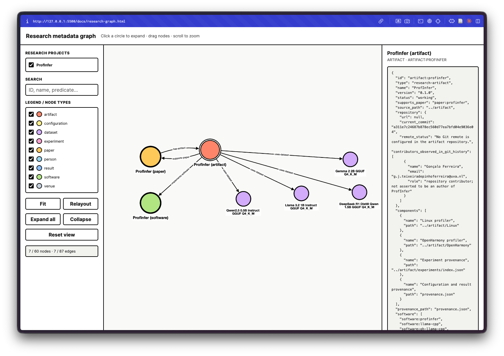

# Research papers and reproducibility artifacts

This repository is a versioned catalogue for research papers, their software artifacts, and the scientific lineage of experiments. Manuscripts and publication metadata live under `paper/` and `metadata/`; executable code, installation guidance, and experiment provenance live under `artifact/`.

## Repository catalogue

| Research work | Paper version | Artifact status | Artifact version | Paper | Artifact and installation | Metadata | Experiments |
|---|---:|---|---:|---|---|---|---|
| ProfInfer | MLSys 2026 manuscript | Working; Linux CPU subset reproduced locally | `0.1.0` / `a311e7c` | [PDF](papers/profinfer/paper/profinfer-mlsys-2026.pdf) | [README](papers/profinfer/artifact/README.md) | [Paper](papers/profinfer/metadata/paper.json) · [Artifact](papers/profinfer/metadata/artifact.json) | [Index](papers/profinfer/artifact/experiments/index.json) |

External repositories used by the current artifact are pinned or marked unknown explicitly:

| Repository | Role | Status | Current/pinned version | Original link |
|---|---|---|---|---|
| ProfInfer artifact | Research implementation | Present as nested Git repository; no remote configured | `0.1.0` / `a311e7c` | Unknown; requires author confirmation |
| llama.cpp | Local inference dependency; excluded from Git | Present locally | `d04e7163` | [ggml-org/llama.cpp](https://github.com/ggml-org/llama.cpp) |
| oh-llama.cpp | Optional accelerator-capable fork | Not version-pinned | Unknown | [OpenHarmony fork](https://gitcode.com/openharmony-robot/oh-llama.cpp) |

The machine-readable entry point is [`catalog.json`](catalog.json). Its metadata model is documented in [`docs/metadata-model.md`](docs/metadata-model.md).

## Interactive graph

Generate an interactive, black-outlined Cytoscape.js visualisation of the entities, provenance records, and relationships:

```bash
python3 scripts/generate_graph.py
```

Open [`docs/research-graph.html`](docs/research-graph.html) in a browser. The default tree view starts from the paper, artifact, and software roots; click nodes to expand relationships, or use the project and legend-type checkboxes to control visibility. Project choices are generated from `catalog.json`, so future research entries are added to the selector automatically. The graph data is embedded in the HTML; loading Cytoscape.js itself requires an internet connection.



## Local-only dependencies and data

Model weights and external source checkouts are deliberately not versioned. The root `.gitignore` excludes `models/`, `llama.cpp/`, and the common misspelling `llama.cp/`. Each artifact documents the exact external revision and expected local layout needed for reproduction.

## Adding another paper

Create `papers/<slug>/paper`, `artifact`, and `metadata` directories; place installation and execution guidance at that artifact's root; assign stable namespaced entity IDs; add references to `catalog.json`; and run:

```bash
python3 scripts/validate_metadata.py
```

The catalogue and its schema are experimental and will evolve as new papers and experiment families are added.
